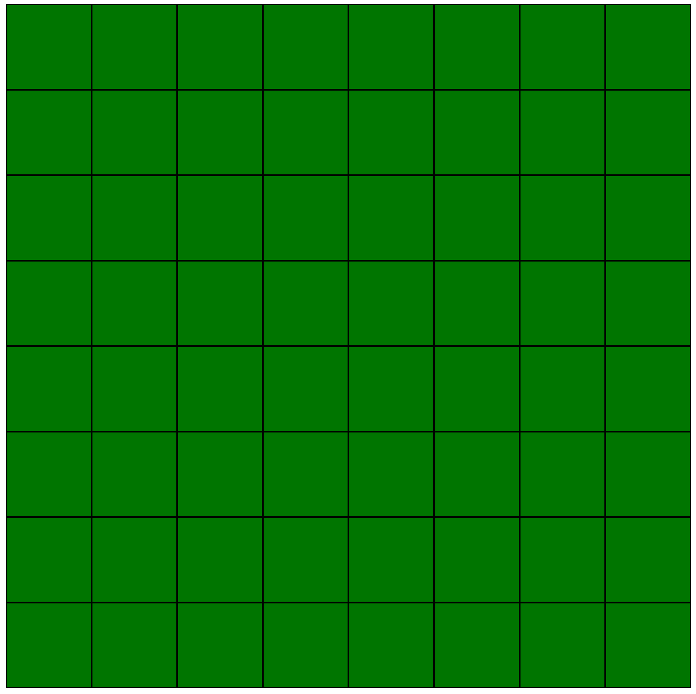
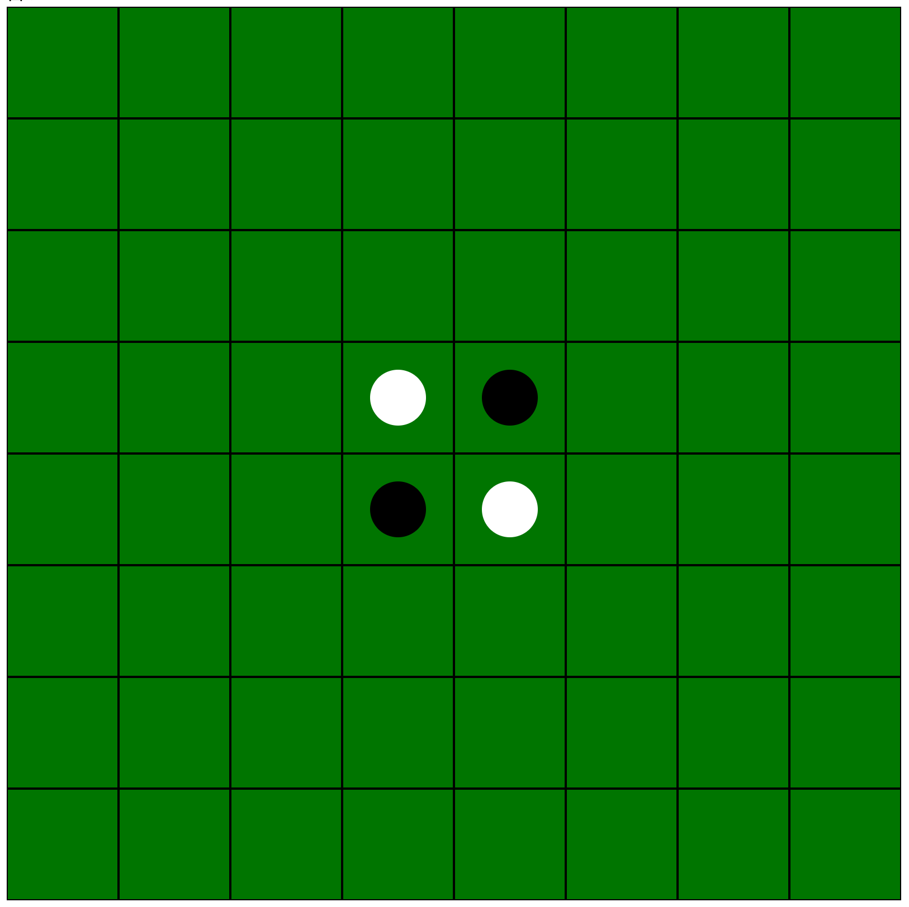

# オセロゲーム作成のステップ

## STEP1: ボードの作成（レイアウト）

### 1. ボードの作成

オセロのボードを作成します。ボードは8x8のマス目で構成されています。
各マス目には、白石、黒石、空白のいずれかが置かれます。

`HTML`, `CSS` を使って、ボードを作成しましょう。

まずは、以下のようなボードを作成してください。

### 2. 初期の石を配置

ボードの初期状態で、中央に白石と黒石を配置します。

**Hint:** 白石、黒石専用のクラスを付与しておくと、後々の処理が楽になります。

## STEP2: データ構造の設計

### 1. ボードのデータ構造

ボードのデータ構造を設計します。ボードは8x8のマス目で構成されています。
各マス目には、白石、黒石、空白のいずれかが置かれます。

8x8の2次元配列を使って、ボードのデータ構造を設計しましょう。

